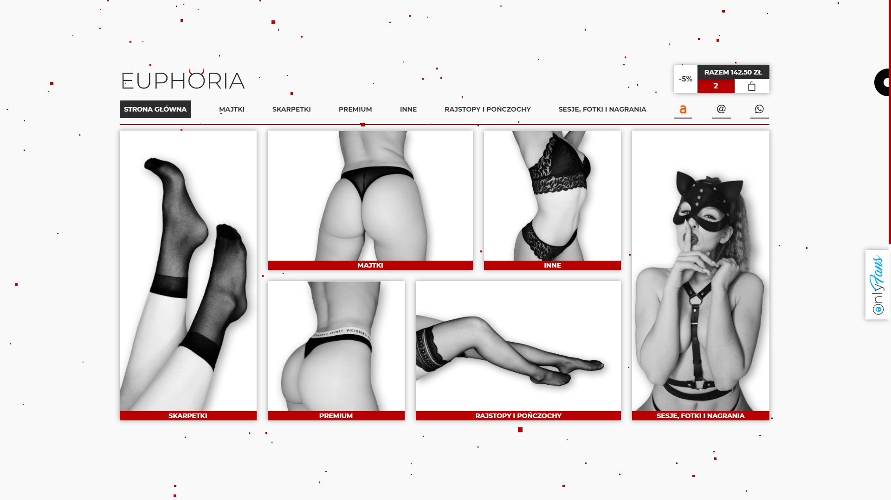
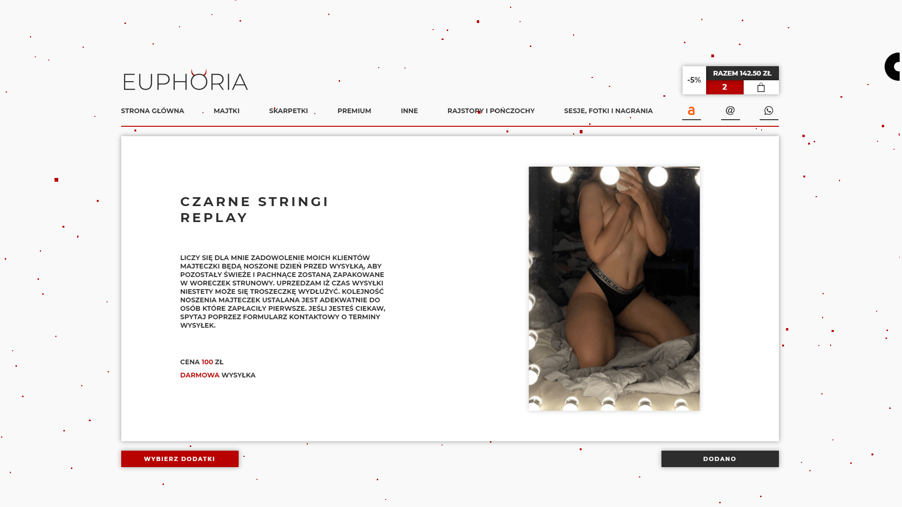
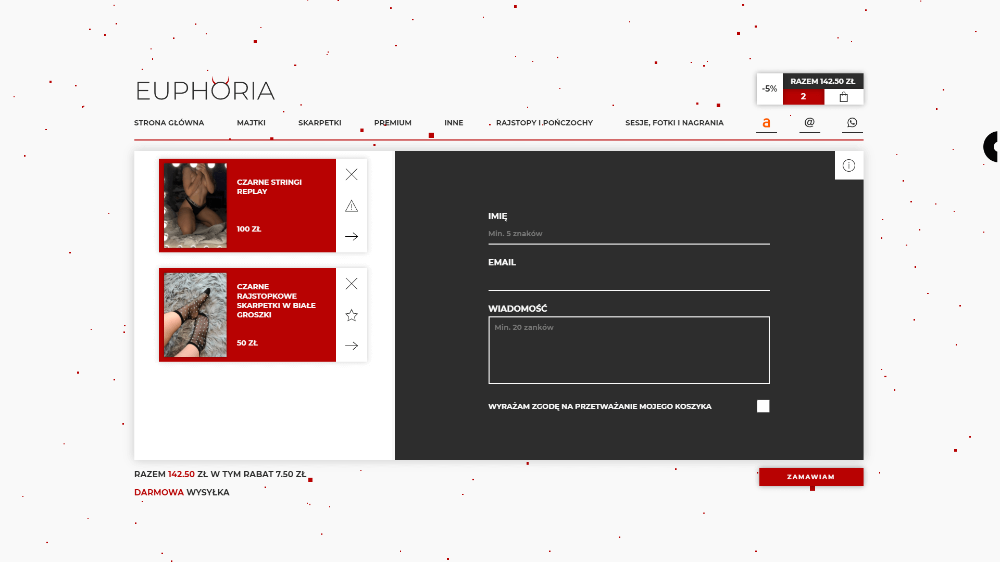

<br />
<br />


<br />

<br />

# Euphoria - Shop for a used underwear fetishists 💋

https://euphorianoszonabielizna.pl/

<br />

### About Project

This project is basically my wife's website, for a while she was only using Allegro for selling worn underwear until I started learning programming. There are a couple reasons why I've made this project but most important ones are: no commission on the sale and she doesn't care about their stupid terms of use, by that I mean (all images on business account must be on rgba(255,255,255) background) which doesn't encourage clients at all. Creating a fully working shop with a couple of nice features was pretty and what is most exciting, GREAT FUN! Besides, I've learned lots of useful things and the project is still under development to meet the currently emerging needs.

<br />

## Used Technologies
* React - version 17.0.2
* React-router-dom - version 5.2.0
* Styled-components - version 5.3.0
* Framer-motion - version 4.1.17
* Three.js - version 0.135.0
* Email.js - version 3.4.0
* React-intersection-observer - version 8.32.0
* Strapi.js (for products management)

<br />

## Features

- Different main color on each refresh
- Adding products to the cart
- Choosing different extras for each product (two of them are for free, after adding more add 10PLN to product price for each), (if available), (for premium panties extras are unlimited and for free)
- Get different discounts on cart value (150PLN - 5%, 250PLN - 10%, 500PLN - 15%), (some photo sessions are excluded from discounts, still they will cause discounts on other products that can be discounted)
- Send your order via form with validation (my wife will get all the information about it via email) (links to products images from AWS, extras someone choose to each product and total cart value).
- Images slider in every product
- Auto seasonal offer (tights and stockings available only in certain months in winter)
- Following sticky navigation after scrolling down in products list
- All products are connected to Strapi.js, so adding and removing them is pretty simple (and much faster than on Allegro)
- Custom cursor
- "Newest" items that were added within 14 days are highlighted
- Search Bar in each product category

<br />

## How to run?

1. Clone the project

```bash
  git clone https://github.com/BlackAndWhiteCarnage/EUPHORI.git
```

2. Install dependencies

```bash
  npm install
```

3. Run project

```bash
  npm start
```

<br />

## Quick Preview

### Home Page


### Products Categories


### Single Product


### Cart


<br />

## Author

- [@BlackAndWhiteCarnage](https://github.com/BlackAndWhiteCarnage)
