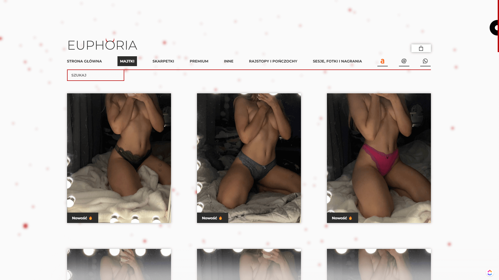

<br />
<br />

# Euphoria - Shop for a used underwear fetishists 💋

https://euphorianoszonabielizna.pl/

<br />

### About Project

The project is basically my wife's website, for a while she was only using Allegro for selling worn underwear until I've started learning programming. There are couple reasons why I've made this
project but most important ones are: no commission on the sale and she doesnt care about their really stupid terms of use, by that I mean (all images on rgba(255,255,255) background) wich doesnt encourages clients at all.
Also creating fully working shop with couple of nice features was pretty challenging and most important, FUN!.

<br />

## Used Technologies
* React - version 17.0.2
* React-router-dom - version 5.2.0
* Styled-components - version 5.3.0
* Framer-motion - version 4.1.17
* Three.js - version 0.135.0
* Email.js - version 3.4.0
* React-intersection-observer - version 8.32.0
* Strapi.js (for products management)

<br />

## Features

- Adding products to cart
- Choosing extras for each product (two are free, after adding more +10PLN to product price for each), (if available), (for premium panties extras are unlimited)
- Get different discounts on cart value (150PLN - 5%, 250PLN - 10%, 500PLN - 15%), (some products are excluded from discount, still they cause discounts on other products that can be discounted)
- Send your order (my wife will get all the informations about it via email) (links to product images from AWS, extras someone choose to each product and total cart value)
- Image slider in every product
- Auto Sesonal offer (tights and stockings only in winter)
- Following navigation after scrolling down
- All produscts are connected to Strapi.js so adding and removing them is pretty simple

<br />

## How to run?

1. Clone the project

```bash
  git clone https://github.com/BlackAndWhiteCarnage/EUPHORI.git
```

2. Install dependencies

```bash
  npm install
```

3. Run project

```bash
  npm start
```

<br />

## Quick Preview

### Home Page


### Products Categories


### Single Product


### Cart


<br />

## Author

- [@BlackAndWhiteCarnage](https://github.com/BlackAndWhiteCarnage)
